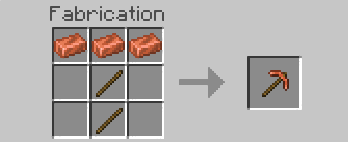
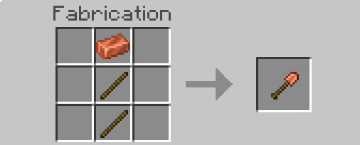
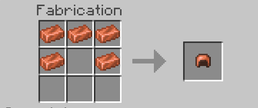
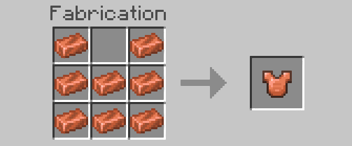
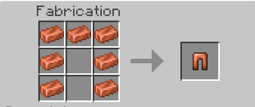
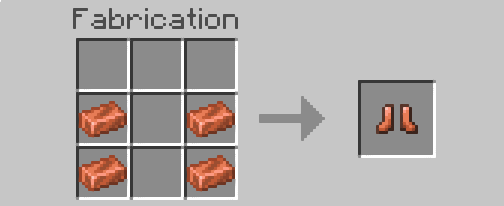

# CopperCraft Plugin v1.0.0

The **CopperCraft** plugin is a fantastic (hehe) addition to your PocketMine-MP server, introducing copper, complete with tools and armor. This plugin is designed for PocketMine-MP version 5.0.0.

## Features

- Adds copper ore to your Minecraft world.
- Allows players to mine copper and craft tools and armor.
- Custom crafting recipes for copper tools and armor.
- Enhances the gameplay experience with new possibilities.

## Installation

1. Make sure you have **PocketMine-MP version 5.0.0 or higher** installed on your server.
2. Download the latest version of **CopperCraft** from [here](https://github.com/Refaltor77/CopperVanillaMods/releases/download/1.0.0/CopperVanillaMods_v1.0.0.phar) or from [GitHub](https://github.com/Refaltor77/CopperVanillaMods).
3. Place the downloaded `.phar` file into your PocketMine-MP server's plugins folder.

## Crafting Recipes

Craft custom copper tools and armor using the following recipes:

- Copper Pickaxe: 
- Copper Shovel: 
- Copper Helmet: 
- Copper Chestplate: 
- Copper Leggings: 
- Copper Boots: 

## Usage

Players can mine copper ore, smelt it into ingots, and use the ingots to craft copper tools and armor. Equip the copper gear and mine more efficiently or protect yourself with copper armor.

## Contributors

- [Refaltor](https://github.com/Refaltor77) - Lead Developer

## License

This project is licensed under the [License Name](https://github.com/Refaltor77/CopperVanillaMods/blob/main/LICENSE).

## Acknowledgments

We appreciate the PocketMine-MP community for their support and contributions to this project.

---
